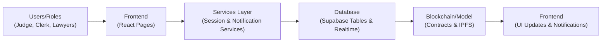

<h1 align="center">
  <a href="https://github.com/CommunityOfCoders/Inheritance2k25">
    CoC Inheritance 2025
  </a>
  <br>
   NyaySutra ⚖️
</h1>

<div align="center">
By Sleep Deprived Dreamers
  
</div>
<hr>

<details>
<summary>Table of Contents</summary>

- [Description](#description)
- [Links](#links)
- [Tech Stack](#tech-stack)
- [Progress](#progress)
- [Future Scope](#future-scope)
- [Applications](#applications)
- [Project Setup](#project-setup)
- [Team Members](#team-members)
- [Mentors](#mentors)

</details>

## 📝 Description

NyaySutra is a blockchain-based platform designed to make India's legal system more secure and transparent. It replaces traditional, easily tampered paper or digital records with a decentralized system that ensures legal documents are permanent and verifiable.

The project works by taking important court documents, encrypting them, and storing them on a decentralized network (IPFS). Instead of relying on a single central server that could be hacked, the system records a unique "digital fingerprint" (hash) of every document on a blockchain ledger.

## 🔗 Links

- [NyaySutra](https://github.com/shravan-patil/NayaSutra_Inheritance.git)

- [Demo Video](comming_soon)

- [Project Screenshots/Drive](https://drive.google.com/drive/folders/1yGDz8Py2xAnWdpPGFDwwsX5C9xIeHU9n?usp=sharing)

- [Hosted Website](https://not_hosted_yet)

## 🤖 Tech-Stack

### 🏗️ System Architecture



### Front-end

- React
- TypeScript
- TailwindCSS

### Back-end
- Blockchain Smart Contracts
- IPFS Storage
### Database / Blockchain / ML (Optional Sections)

- Supabase
- ethers.js
- Solidity
## 📈 Progress

### Fully Implemented Features

* **Wallet-Based Authentication** — Users connect their MetaMask wallet to securely sign in and perform all blockchain actions with their own digital signature.
* **Clerk Case Registration & Management** — Court clerks can create new cases, assign judges and lawyers, schedule hearings, and manage all case details from a dedicated dashboard.
* **Multi-Party Session Signature & Finalization** — All participants (judge, lawyers, clerk) receive notifications to confirm session outcomes; the judge reviews and gives final approval, permanently recording everything on the blockchain.
* **Police FIR Registration & Case Creation** — Police officers can file a First Information Report (FIR) with details and evidence; the system automatically creates a corresponding court case.
* **Lawyer Case Access & Participation** — Assigned lawyers can view their cases, upload evidence during proceedings, participate in sessions, and confirm session conclusions.

---

### Partially Implemented Features / Work in Progress

* **Full IPFS Evidence & Transcript Storage** — Infrastructure is ready to permanently store session documents and transcripts on IPFS (currently using placeholder storage).
* **Advanced Real-time Notifications** — Basic real-time updates are working via Supabase; push notifications outside the browser are planned next.

## 🔮 Future Scope

While the current MVP of NyaySutra successfully demonstrates the core concept of blockchain-backed legal integrity, we have identified several key areas for evolution:

- **Full Decentralization (Database Shift)**: Transition to Decentralized Databases: Replace centralized storage with protocols like OrbitDB, Polybase, or Base to ensure that even metadata is distributed and censorship-resistant.

- **Public Disclosure & Transparency**: Open Access Layer: A read-only interface allowing citizens to verify the existence and status of public court orders without needing a digital wallet or specialized access. 

- **Scalability & Cost Optimization (L2 Rollup Integration)**: Currently, NyaySutra operates on a Layer 1 (L1) architecture where every transaction is processed individually on the main chain. This results in high gas fees and limited transaction throughput. We want to transition to a Layer 2 (L2) Rollup architecture

## 💸 Applications

1. **Courts** - Reduce paperwork and improve transparency of session outcomes.

2. **Legal professionals** - Faster confirmations and predictable workflow.

3. **Clerks** - Centralized tracking of sessions, signatures, and next hearing dates.

4. **Compliance / Audits** - Immutable proof of confirmations and session events.

## 🛠 Project Setup

1. Clone the GitHub repo.

```bash
git clone https://github.com/shravan-patil/NayaSutra_Inheritance.git

```

2. Enter the project directory and install dependencies.

```bash
cd NayaSutra_Inheritance
npm install
```

3. Initialze the supabase database and add the required tables and configurations as per the project requirements.

4. Deploy the smart contracts to the desired blockchain network (e.g., Ethereum testnet) and update the contract addresses in the frontend configuration.
```bash
cd blockchain_backend/script
forge script script/Deploy.s.sol --broadcast --rpc-url <RPC_URL> --private-key <PRIVATE_KEY>
```
5.Update the env files with the necessary API keys, contract addresses, and other configurations. reference is provided in the .env.example file.

6. Start the development server.

```bash
npm run dev
```
## 👨‍💻 Team Members

* **[Ninad Dhote](https://github.com/Ninad2006-cell)**
* **[Shubham Dudhbhate](https://github.com/Shubhamdudhbhate)**
* **[Shravan Patil](https://github.com/shravan-patil)** 
* **[Pratham Muley](https://github.com/Pratham19106)** 

## 👨‍🏫 Mentors

* **[Rupak Gupta](https://github.com/aitwehrrg)**
* **[Aarya Pandey](https://github.com/geeky33)**

